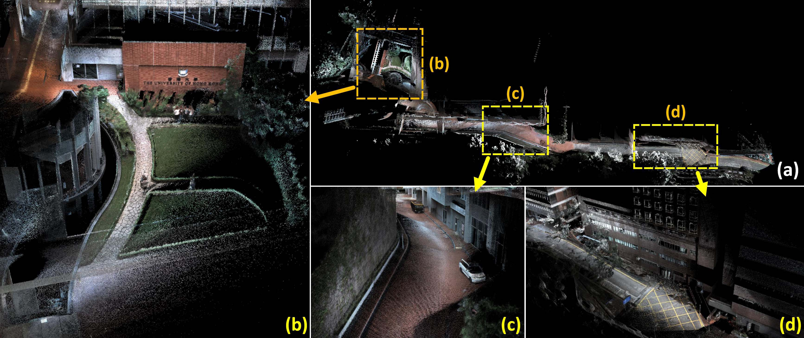
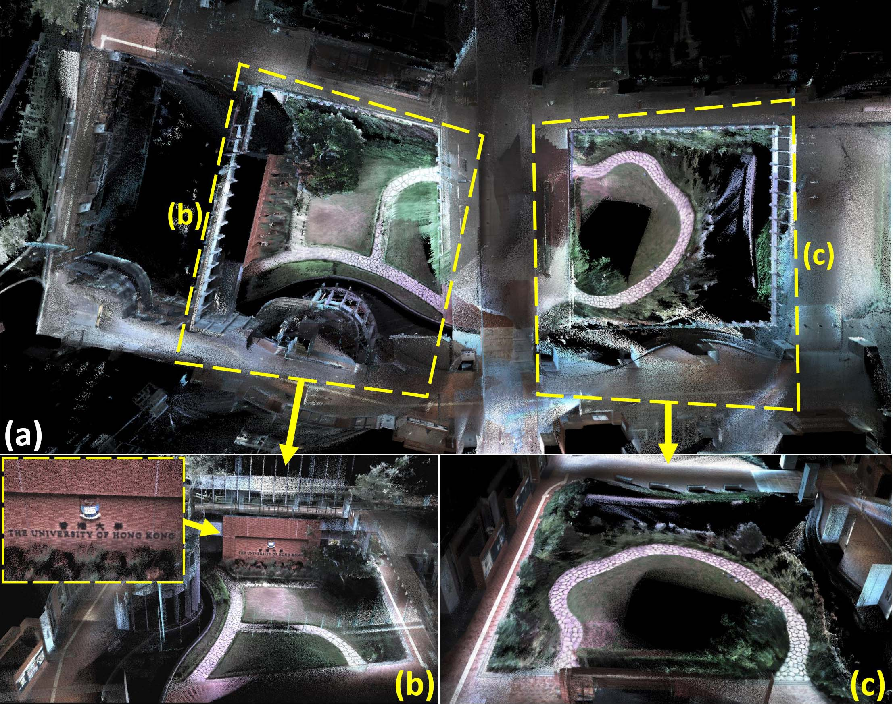
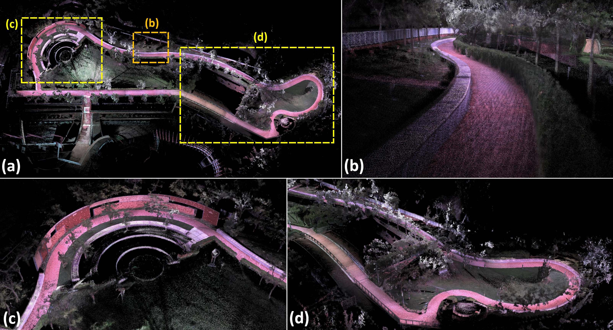
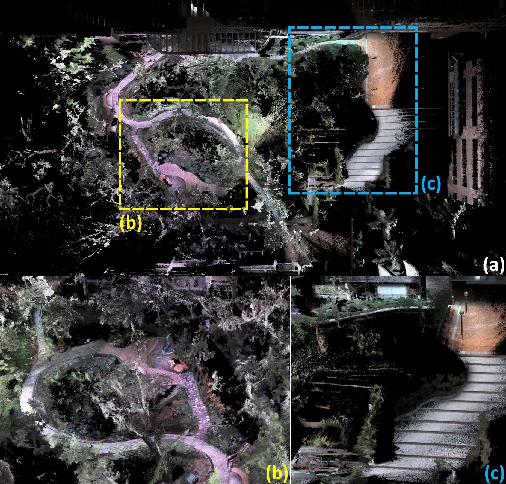
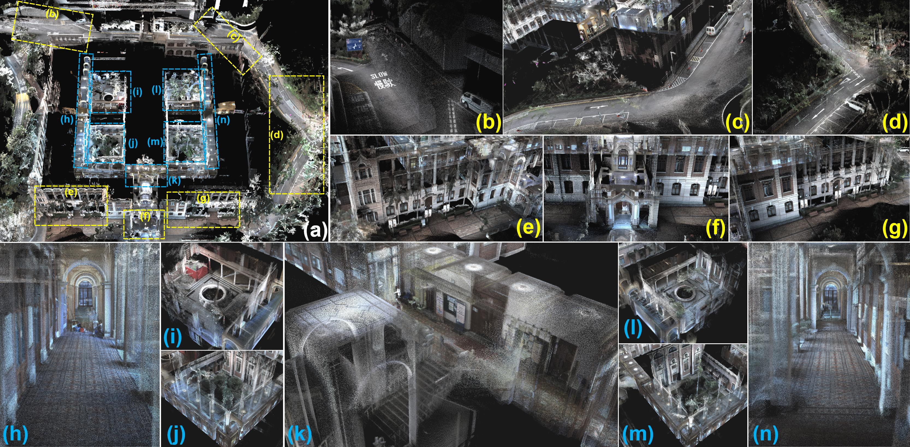
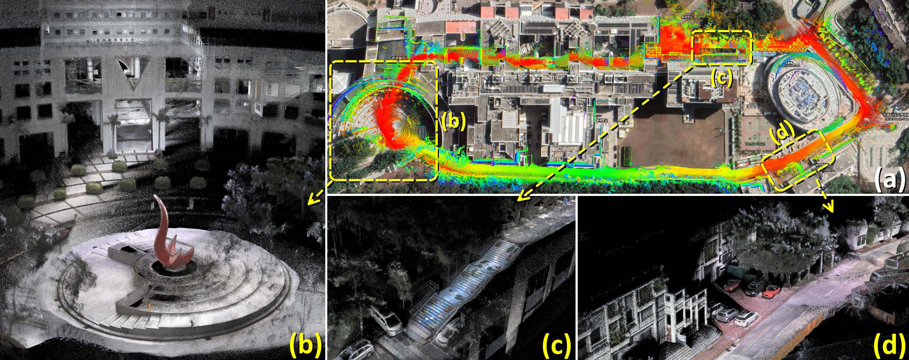
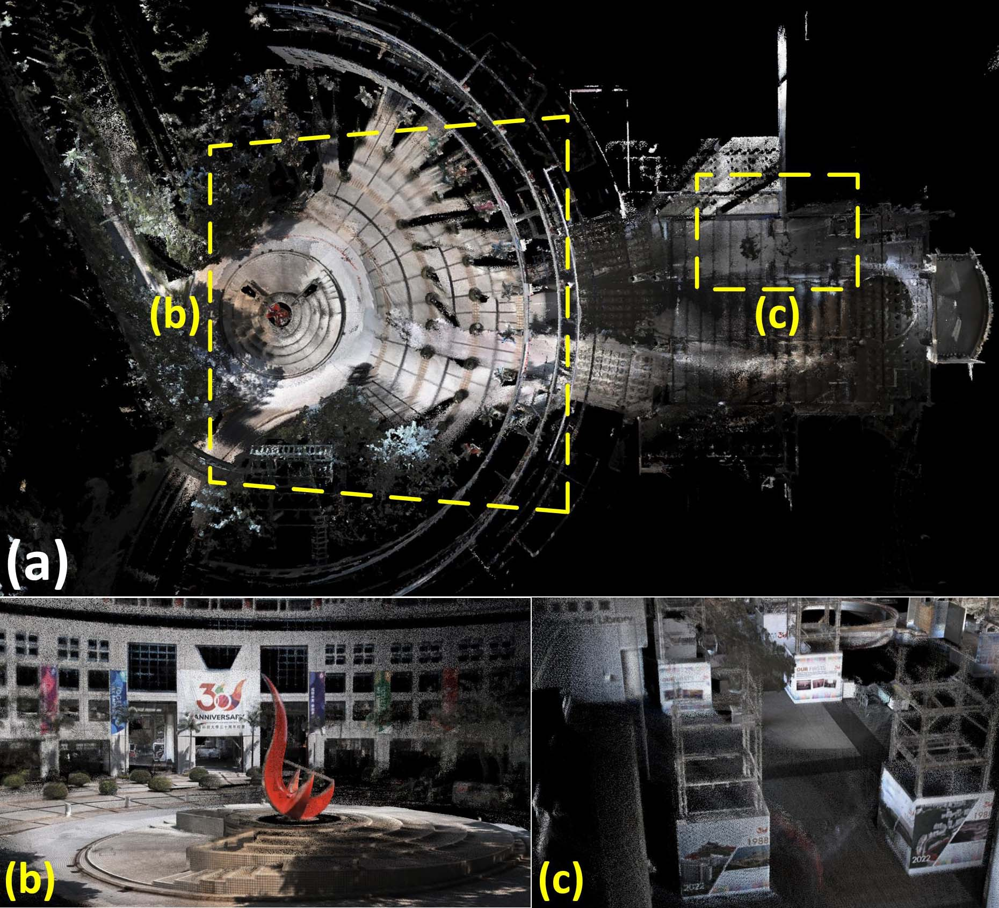
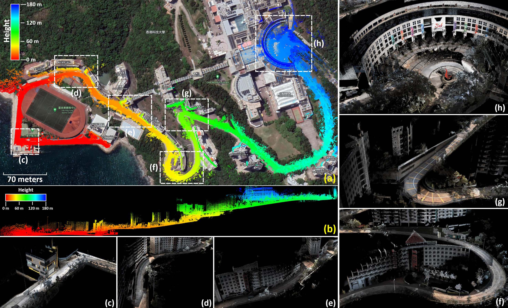

# R3LIVE-Dataset  
## 1. Introduction
This reposity introduces an associate dataset of our work R3LIVE, termed R3LIVE-Dataset. This dataset was collected within the campuses of the University of Hong Kong (HKU) and the Hong Kong University of Science and Technology (HKUST), including 13 sequences that are collected by exploring both indoor and outdoor environments. R3LIVE-dataset is collected in various scenes (e.g., walkway, park, forest, etc) at different times in a day (i.e., morning, noon, and evening), which allows the dataset to capture both structured urban buildings and cluttered field environments with different lighting conditions. The dataset also includes three sequences (degenerate_seq_00/01/02) where the LiDAR or camera (or both) degenerate by occasionally facing the device to a single and/or texture-less plane (e.g., wall, the ground) or visually. The total traveling length reaches 8.4 Km, duration reaching 2.4 hours.


## 2. How to get?
Our dataset can be downloaded form [Microsoft OneDrive](https://connecthkuhk-my.sharepoint.com/:f:/g/personal/zivlin_connect_hku_hk/Eopy_2b77h9MoazWbQYC3-wBvj7rZ2xDs2hv-ilWurhdRA?e=mhDohb)
```
https://connecthkuhk-my.sharepoint.com/:f:/g/personal/zivlin_connect_hku_hk/Eopy_2b77h9MoazWbQYC3-wBvj7rZ2xDs2hv-ilWurhdRA?e=mhDohb
```
or from [Baidu-NetDisk [百度网盘]](https://pan.baidu.com/s/1zmVxkcwOSul8oTBwaHfuFg):
```
Link(链接)  ： https://pan.baidu.com/s/1zmVxkcwOSul8oTBwaHfuFg
Code(提取码)： wwxw
```

## 3. Brief overview
A brief overview of these 14 sequences are shown as follows:


|      Sequence     | Duration (s) | Traveling  Length (m) <sup>[1] | Sensor  Degeneration |  Return  to origin <sup>[2]     | Aruco marker <sup>[3] | Camera exposure  time<sup>[4] |      Scenarios     |
|:-----------------:|:------------:|:---------------------:|:--------------------:|:-----------------------:|:------------:|:---------------------:|:------------------:|
| degenerate_seq_00 |      86      |          53.3         |         LiDAR        |           Yes           |              |                       |       Outdoor      |
| degenerate_seq_01 |      85      |          75.2         |         LiDAR        |           Yes           |              |                       |       Outdoor      |
| degenerate_seq_02 |      101     |          74.9         |Camera, LiDAR <sup>[5]|           Yes           |      Yes     |                       |       Indoor       |
| hku_campus_seq_00 |      202     |         190.6         |         ----         |           Yes           |              |                       |       Indoor       |
| hku_campus_seq_01 |      304     |         374.6         |         ----         |                         |              |                       |       Outdoor      |
| hku_campus_seq_02 |      323     |         354.3         |         ----         |           Yes           |              |          Yes          |   Indoor, Outdoor  |
| hku_campus_seq_03 |      173     |         181.2         |         ----         |           Yes           |              |          Yes          |   Indoor, Outdoor  |
| hku_main_building |     1170     |         1036.9        |         ----         |           Yes           |              |          Yes          |   Indoor, Outdoor  |
|    hku_park_00    |      228     |         247.3         |         ----         |           Yes           |      Yes     |                       | Outdoor, Cluttered |
|    hku_park_01    |      351     |         401.8         |         ----         |           Yes           |      Yes     |                       | Outdoor, Cluttered |
|  hkust_campus_00  |     1073     |         1317.2        |         ----         |           Yes           |      Yes     |                       |   Indoor, Outdoor  |
|  hkust_campus_01  |     1162     |         1524.3        |         ----         |           Yes           |      Yes     |                       |   Indoor, Outdoor  |
|  hkust_campus_02  |     1618     |         2112.2        |         ----         |                         |              |          Yes          |       Outdoor      |
|  hkust_campus_03  |      478     |         503.8         |         ----         |           Yes           |              |          Yes          |   Indoor, Outdoor  |
|    **Total**      |     7354     |         8447.6        |                      |                         |              |                       |                    |

[1]: The length of traveling is calculated with the result of [R3LIVE](https://github.com/hku-mars/r3live) algorithm.<br>
[2]: Sequences are collected by traveling a loop, with starting from and ending with the same position.<br>
[3]: Sequences with ArUco marker for providing the ground-truth relative pose.<br>
[4]: Sequences with ground-truth camera exposure time read from camera's API.<br>
[5]: With very limited visual features in this scenario (see Experiment-1 of our [paper](https://github.com/hku-mars/r3live/blob/master/papers/R3LIVE:%20A%20Robust%2C%20Real-time%2C%20RGB-colored%2C%20LiDAR-Inertial-Visual%20tightly-coupled%20stateEstimation%20and%20mapping%20package.pdf)).

## 4. Data format
Each of our sequences is released as a simple rosbag file, and you can view the detail of each sequence with the command "rosbag info xxx.bag".

Take sequence "hku_main_building.bag" as an exmple:
```
rosbag info hku_main_building.bag
```
You can see:
```
path:        hku_main_building.bag
version:     2.0
duration:    18:11s (1091s)
start:       Feb 13 2022 14:55:54.90 (1644735354.90)
end:         Feb 13 2022 15:14:06.70 (1644736446.70)
size:        7.3 GB
messages:    266130
compression: none [8266/8266 chunks]
types:       livox_ros_driver/CustomMsg  [e4d6829bdfe657cb6c21a746c86b21a6]
             sensor_msgs/CameraInfo      [c9a58c1b0b154e0e6da7578cb991d214]
             sensor_msgs/CompressedImage [8f7a12909da2c9d3332d540a0977563f]
             sensor_msgs/Imu             [6a62c6daae103f4ff57a132d6f95cec2]
topics:      /camera/image_color/compressed    16320 msgs    : sensor_msgs/CompressedImage
             /camera/image_color_frame_info    16320 msgs    : sensor_msgs/CameraInfo     
             /livox/imu                       222573 msgs    : sensor_msgs/Imu            
             /livox/lidar                      10917 msgs    : livox_ros_driver/CustomMsg

```
The data in each topic is explained as follows:
| Topic name                     | Sensor data                           | Frequency            | Message type                |
|--------------------------------|---------------------------------------|----------------------|-----------------------------|
| /camera/image_color/compressed | The recorded color image              | 15HZ                 | sensor_msgs/CompressedImage |
| /camera/image_color_frame_info | The ground truth camera exposure time <sup>[1] | 15HZ (same as image) | sensor_msgs/CameraInfo      |
| /livox/imu                     | The recorded IMU data                 | 200Hz                | sensor_msgs/Imu             |
| /livox/lidar                   | The recorder LiDAR data <sup>[2]              | 10HZ                 | livox_ros_driver/CustomMsg  |

[1]: The ground-truth camera exposure time is read from the camera API (see [Technical Reference for BFS-U3-13Y3.pdf](https://www.restarcc.com/dcms_media/other/BFS-U3-13Y3-Technical-Reference_compressed.pdf))  <br>
[2]: See [livox_ros_driver](https://github.com/Livox-SDK/livox_ros_driver).<br>

**Notice:** For the sake of convenience, the ground-truth camera exposure time is stored as a string in "/camera/image_color_framenfo/distortion_model", with its timestamp equal to its correspondence image. 

You can see the details of camera exposure time by:
```
rosbag play YOUR_DOWNLOADED.bag
rostopic echo /camera/image_color_frame_info/distortion_model
```
and you will see the print as below:
```
"Camera_timestamp = 121202934544, exposure_time = 2.948 ms, gain = 8.9927 db"
```


## 5. Details of each sequence

### 5.1 degenerate_seq_00
In this sequence, we sampled the data with data with intentionally making the LiDAR sensor facing the pure plane (i.e., the floor), as shown in the following figure. In this scenario, the LiDAR is well-known degenerated in estimating the full pose.
<div align="center">
<br>

</div>

### 5.2 degenerate_seq_01
Similar to 'degenerate_seq_00', we sampled this sequence of data for testing the robustness of [R3LIVE](https://github.com/hku-mars/r3live) in LiDAR degenerated scenario, shown as below:
<div align="center">
<br>

</div>

### 5.3 degenerate_seq_02
In this sequence, we sampled the data by passing through a narrow “T”-shape passage while occasionally facing against the sidewalls, where the visual textures on walls are very limited (see Fig. a and Fig. c). This sequence of data is used for evaluating the robustness of [R3LIVE](https://github.com/hku-mars/r3live) in simultaneously LiDAR degenerated and visual texture-less environments. We refer our users to see Experiment-1 of our [paper](https://github.com/hku-mars/r3live/blob/master/papers/R3LIVE:%20A%20Robust%2C%20Real-time%2C%20RGB-colored%2C%20LiDAR-Inertial-Visual%20tightly-coupled%20stateEstimation%20and%20mapping%20package.pdf) for more details.

<div align="center">


</div>


### 5.4 hku_campus_seq_00~03
In these four sequences, we sample data in the campus of The University of Hong Kong (HKU). We use these sequences of data to evaluate the capacity of [R3LIVE](https://github.com/hku-mars/r3live) for real-time reconstructing the radiance map. The mapping results of R3LIVE in these four sequences are shown follows:

<div align="center">
<br>
<font color=#a0a0a0 size=2>Our mapping result of sequence "hku_campus_seq_00".</font><br>
<br>
<font color=#a0a0a0 size=2>Sequence "hku_campus_seq_01" are collected by walking along the drive way of the HKU campus. (a) is the birdview of the whole radiance map, with its details shown in (b~d).</font><br>
<br>
<font color=#a0a0a0 size=2>Sequence ``hku_campus_seq_/02/03" are sampled at the same place but at different times of day (evening and morning, respectively) and with different traveling trajectories. (a) is the birdview of map of sequence ``hku_campus_seq_02", with the closeup view of details are shown in (b) and (c).</font>
</div>

### 5.5 hku_park_00~01
In these two sequences, we sample the data in a complex and unstructured environment, where have a lot of trees, bushes, flowers, and etc.  The mapping results of [R3LIVE](https://github.com/hku-mars/r3live) in these two sequences are shown below:
<div align="center">
<br>
<font color=#a0a0a0 size=2>Sequence ``hku_park_00" is collected by walking along the pathway of a garden of HKU. (a) is the birdview of the whole radiance map, with its details shown in (b~d).</font><br>
<br>
<font color=#a0a0a0 size=2>Sequence "hku_park_01" is collected in a cluttered environment with many trees and bushes. (a) is the birdview of the whole radiance map, with its details are shown in (b) and (c).</font>
</div>

### 5.6 hku_main_building
In sequence "hku_main_building", we collect the data in both interior and exterior of the main building of HKU. The radiance map reconstructed by [R3LIVE](https://github.com/hku-mars/r3live) is shown as below
<div align="center">
<br>
<font color=#a0a0a0 size=2>Our reconstructed radiance map of the main building of HKU. (a) The bird's view of the map, with its details shown in (b~n). (b~g) closeup of outdoor scenarios and (h~n) closeup of indoor scenarios.</font><br>
</div>

### 5.6 hkust_campus_seq_00~03
In these four sequences, we collect the data within the campus of the Hong Kong University of Science and Technology (HKUST), with the length of traveling reach as 1317 and 1524 meters. We use these two sequences to test the ability of [R3LIVE](https://github.com/hku-mars/r3live) in real-time reconstructing the radiance map in a large-scale environment.

<div align="center">
<br>
<font color=#a0a0a0 size=1>Sequence ``hku_campus_seq_00/01" are collected within the campus of HKUST with two different traveling trajectories. In (a), we merge the point cloud of sequence "hku_campus_seq_00" with the GoogleEarth satellite image and find them aligned well. The details of our reconstructed radiance map are selectively shown in (b~d).</font><br>
<br>
<font color=#a0a0a0 size=1>Sequence "hku_campus_seq_02" is collected by exploring the entrance piazza of HKUST, traveling both the interior and exterior of the buildings. (a) is the birdview of the whole radiance map, with the outdoor and indoor scenarios selectively shown in (b) and (c), respectively.</font><br>
<br>
<font color=#a0a0a0 size=1>Sequence ``hkust_campus_seq_03" captures most part of the HKUST's campus,  with the traveling length reaching 2.1 Km. We collected the data starting from the sea front (see the lower left of (a))  and ending at the entrance piazza (the upper right of (a)) of HKUST. In (a), we merge our reconstructed point cloud map (points are colored by their heigh)  with the Google Earth satellite image and find them aligned well. (b)  shows the side view of the map. (c~h) are the closeup views of the details marked in (a). </font><br>
</div>


## Contact us
For any technical issues, please contact me via email Jiarong Lin < ziv.lin.ljrATgmail.com >.<br>
For commercial use, please contact me < ziv.lin.ljrATgmail.com > and Dr. Fu Zhang < fuzhangAThku.hk >