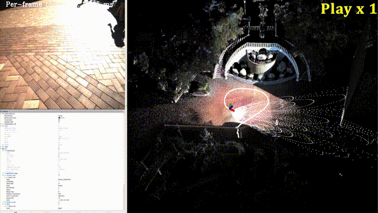
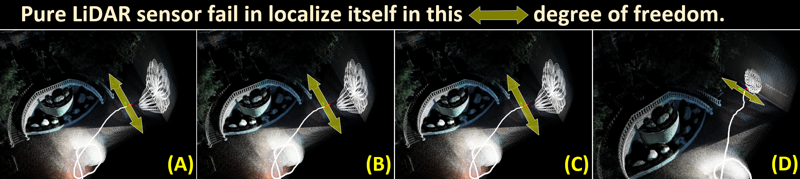
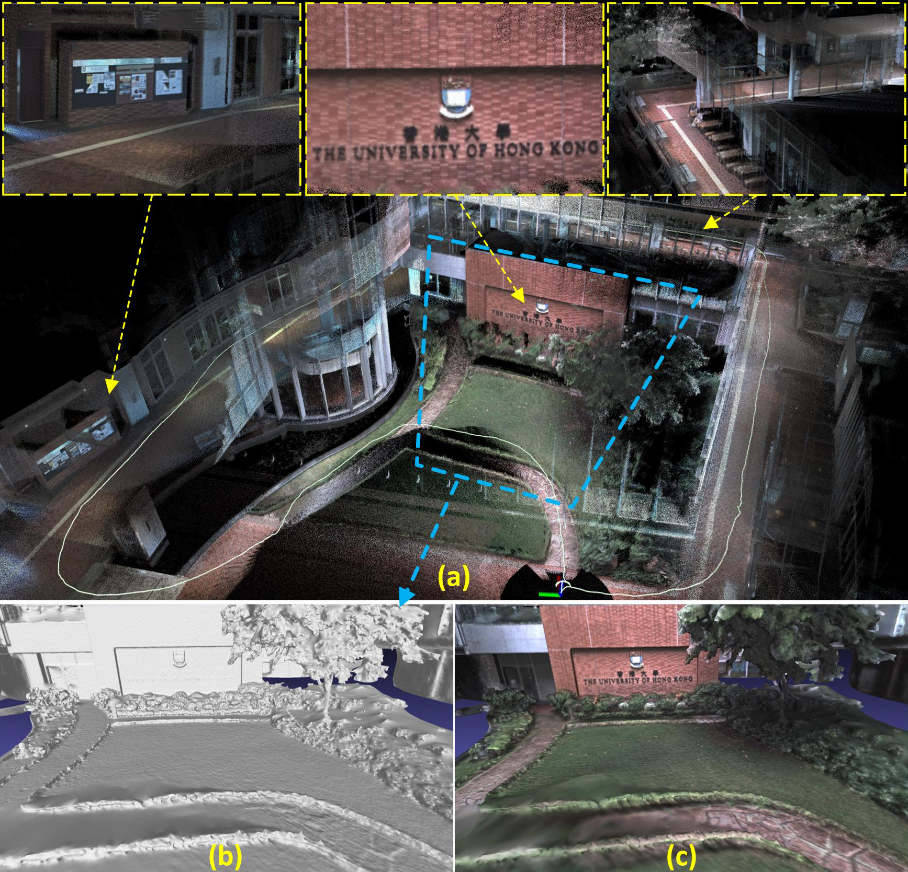
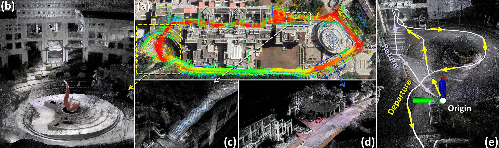

# R3LIVE Dataset  
## 1. Introduction
This project page introduces the datasets for evaluating the [R3LIVE](https://github.com/hku-mars/r3live) algorithm, which includes 9 rosbag files sampled with a handheld device (CAD files are also available on [github](https://github.com/ziv-lin/rxlive_handheld)) in HKU and HKUST campuses.

## 2. How to get?
Our datasets can be downloaded from [Google drive](https://drive.google.com/drive/folders/15i-TRa0EA8BCbNdARVqPMDsU9JOlagVF?usp=sharing):
```
https://drive.google.com/drive/folders/15i-TRa0EA8BCbNdARVqPMDsU9JOlagVF?usp=sharing
```
or from [Baidu-NetDisk [百度网盘]](https://pan.baidu.com/s/1zmVxkcwOSul8oTBwaHfuFg):
```
Link(链接)  ： https://pan.baidu.com/s/1zmVxkcwOSul8oTBwaHfuFg
Code(提取码)： wwxw
```

## 3. Brief overview
A brief overview of these 9 sequences are shown as follows:
| No | Name | Size | Duration | Traveling length <sup>[1] | Return to origin <sup>[2] | Sensor degrade
| :-----: | ----: | :----: |  :----: |  :----: | :----: |:----: |
| 1 | degenerate_seq_00.bag   | 864.8 MB | 101 s   | 74.9 m | Yes | Camera<sup>[3]</sup>, LiDAR |
| 2 | degenerate_seq_01.bag   | 2.1 GB   | 86 s    | 53.3 m | Yes | LiDAR
| 3 | degenerate_seq_02.bag   | 2.1 GB   | 85 s    | 75.2 m | Yes | LiDAR
| 4 | hku_campus_seq_00.bag   | 1.4 GB   | 202 s   | 190.6 m | Yes | - -
| 5 | hku_campus_seq_01.bag   | 2.2 GB   | 304 s   | 374.6 m | No  | - -
| 6 | hku_park_00.bag         | 1.8 GB   | 228 s   | 247.3 m | Yes | - -
| 7 | hku_park_01.bag         | 2.7 GB   | 351 s   | 401.8 m | Yes | - -
| 8 | hkust_campus_seq_00.bag | 7.5 GB   | 1073 s  | 1317 m | Yes | - -
| 9 | hkust_campus_seq_01.bag | 8.2 GB   | 1162 s  | 1524 m | Yes | - -

[1]: The length of traveling is calculated with the result of [R3LIVE](https://github.com/hku-mars/r3live) algorithm.<br>
[2]: We sampled the data by traveling a loop, with finally returning back to the origin (i.e., the distance between the starting and ending position is less than 10 cm).<br>
[3]: With very limited visual features in this scenario (see Experiment-1 of our [paper](https://github.com/hku-mars/r3live/blob/master/papers/R3LIVE:%20A%20Robust%2C%20Real-time%2C%20RGB-colored%2C%20LiDAR-Inertial-Visual%20tightly-coupled%20stateEstimation%20and%20mapping%20package.pdf)).

## 4. Details of each sequence
### 4.1 degenerate_seq_00
In this sequence, we sampled the data by passing through a narrow “T”-shape passage while occasionally facing against the sidewalls, where the visual textures on walls are very limited (see Fig. a and Fig. c). This sequence of data is used for evaluating the robustness of [R3LIVE](https://github.com/hku-mars/r3live) in simultaneously LiDAR degenerated and visual texture-less
environments. We refer our users to see Experiment-1 of our [paper](https://github.com/hku-mars/r3live/blob/master/papers/R3LIVE:%20A%20Robust%2C%20Real-time%2C%20RGB-colored%2C%20LiDAR-Inertial-Visual%20tightly-coupled%20stateEstimation%20and%20mapping%20package.pdf) for more details.

<div align="center">


</div>

### 4.2 degenerate_seq_01
In this sequence, we sampled the data with data with intentionally making the LiDAR sensor facing the pure plane (i.e., the floor), shown in the following figure. In this scenario, the LiDAR is well-known degenerated in estimating the full pose. 
<div align="center">


</div>

### 4.3 degenerate_seq_02
With similar to 'degenerate_seq_01', we sampled this sequence of data for testing the robustness of [R3LIVE](https://github.com/hku-mars/r3live) in LiDAR degenerated scenario, shown as below:
<div align="center">


</div>

### 4.4 hku_campus_seq_00 and hku_campus_seq_01
In these two sequence, we sample data in the campus of The University of Hong Kong (HKU). We use this two sequence of data for evaluating the capacity of [R3LIVE](https://github.com/hku-mars/r3live)
for real-time reconstructing the precise, dense, 3D, RGB-colored map. The mapping results of [R3LIVE](https://github.com/hku-mars/r3live) in these two sequences are shown as follow:

<div align="center">
<br>
<font color=#a0a0a0 size=2>Our mapping result of sequence "hku_campus_seq_00".</font>
<br>
<font color=#a0a0a0 size=2>Our mapping result of sequence "hku_campus_seq_01".</font>
</div>

### 4.5 hku_park_00 and hku_park_01
In these two sequences, we sample the data in a complex and unstructured environment, where have a lot of trees, bushes, flowers, and etc.  The mapping results of [R3LIVE](https://github.com/hku-mars/r3live) in these two sequences are shown below:
<div align="center">
<br>
<font color=#a0a0a0 size=2>Our mapping result of sequence "hku_park_00".</font>
<br>
<font color=#a0a0a0 size=2>Our mapping result of sequence "hku_park_01".</font>
</div>

### 4.6 hkust_campus_seq_00 and hkust_campus_seq_01
In these two sequences, we collect the data within the campus of the Hong Kong University
of Science and Technology (HKUST), with the length of traveling reach as 1317 and 1524 meters. We use these two sequences for testing the ability of [R3LIVE](https://github.com/hku-mars/r3live) in real-time reconstructing the precise, dense, 3D, RGB-colored maps of large-scale environment.
We refer our users to see Experiment-2 of our [paper](https://github.com/hku-mars/r3live/blob/master/papers/R3LIVE:%20A%20Robust%2C%20Real-time%2C%20RGB-colored%2C%20LiDAR-Inertial-Visual%20tightly-coupled%20stateEstimation%20and%20mapping%20package.pdf) for getting more details.

<div align="center">

</div>

## Contact us
For any technical issues, please contact me via email Jiarong Lin < ziv.lin.ljrATgmail.com >.<br>
For commercial use, please contact me < ziv.lin.ljrATgmail.com > and Dr. Fu Zhang < fuzhangAThku.hk >